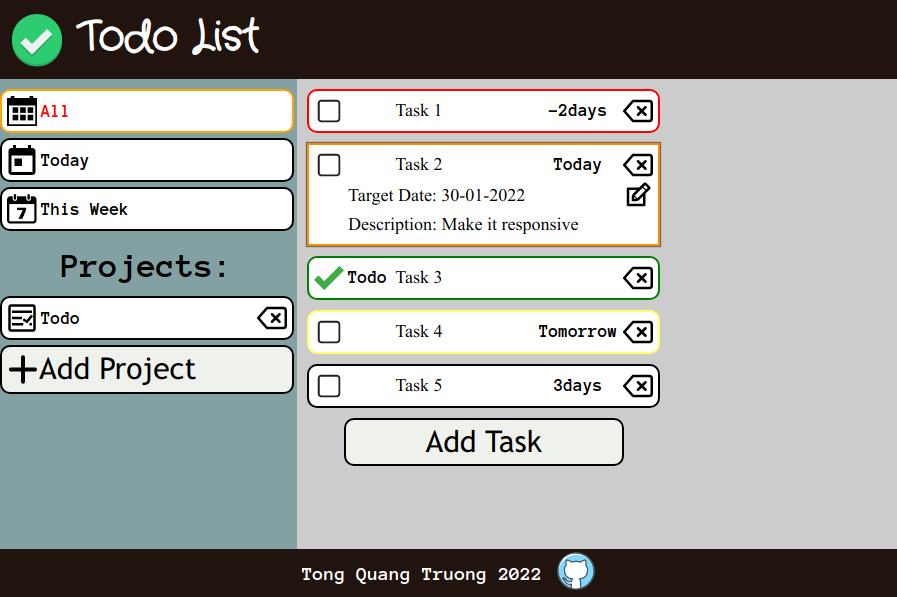

# Todo List

## Live: https://truongwerk.github.io/Todo-List/

## Features:

- Add, delete, edit task.
- Add, delete project.
- Task has: Name, Target Date, Description, Project.
- Show tasks in Different modes: All, Today, This Week, Project.
- Responsive.
- Data saved in local machine.

## Build:

- Vanilla JavaScript.
- Vanilla Css.
- Functional programming, module approach.
- Build by webpack.
